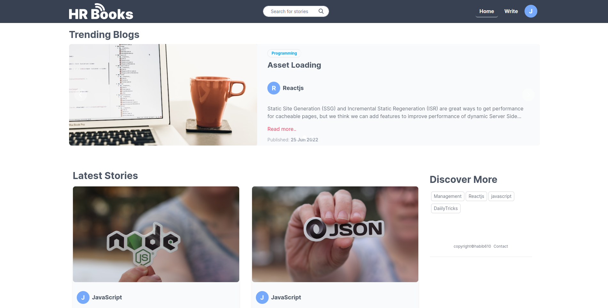
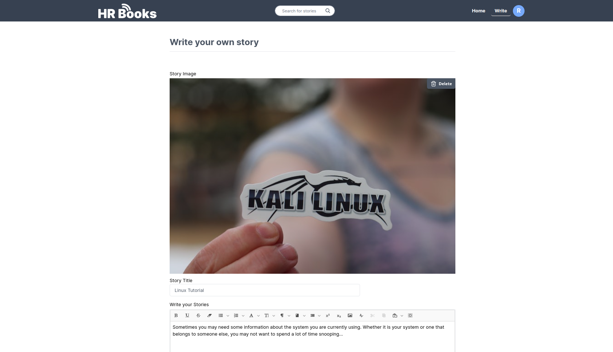
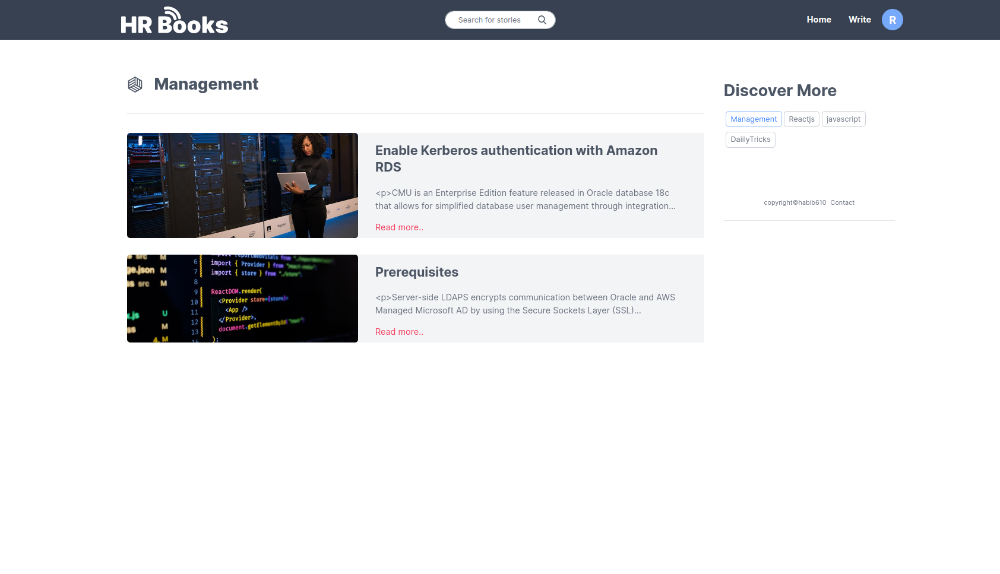
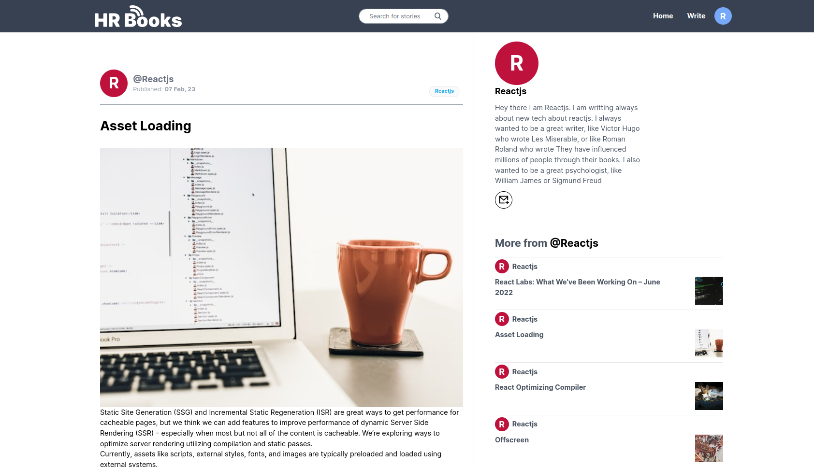
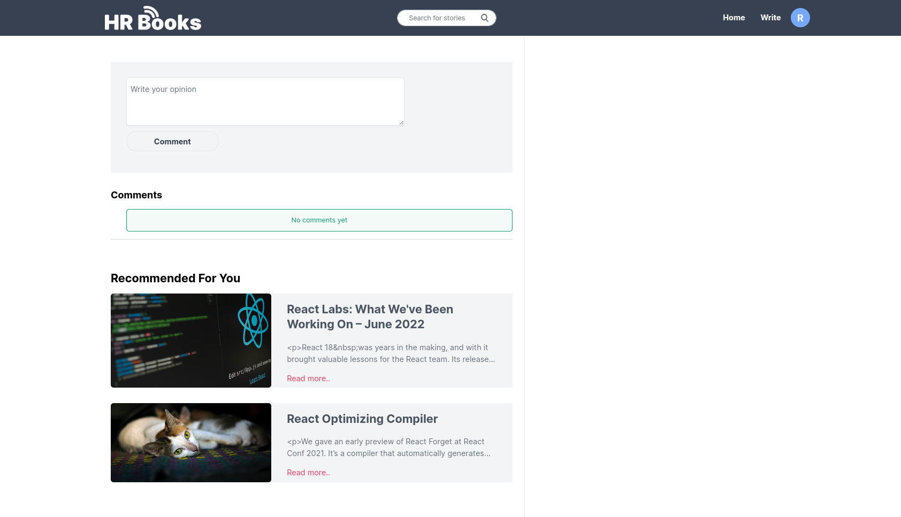
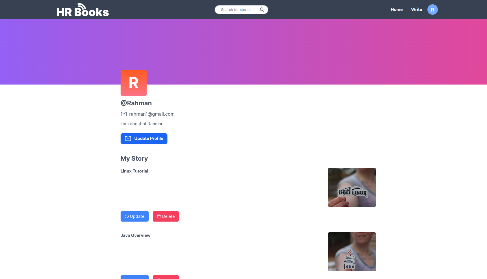
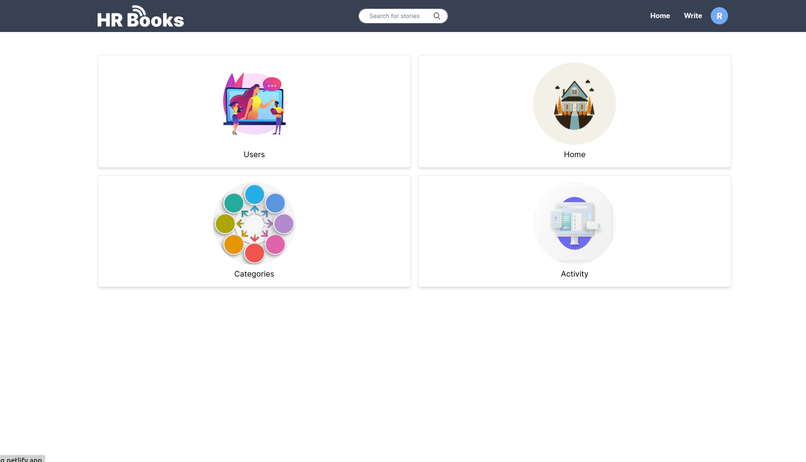
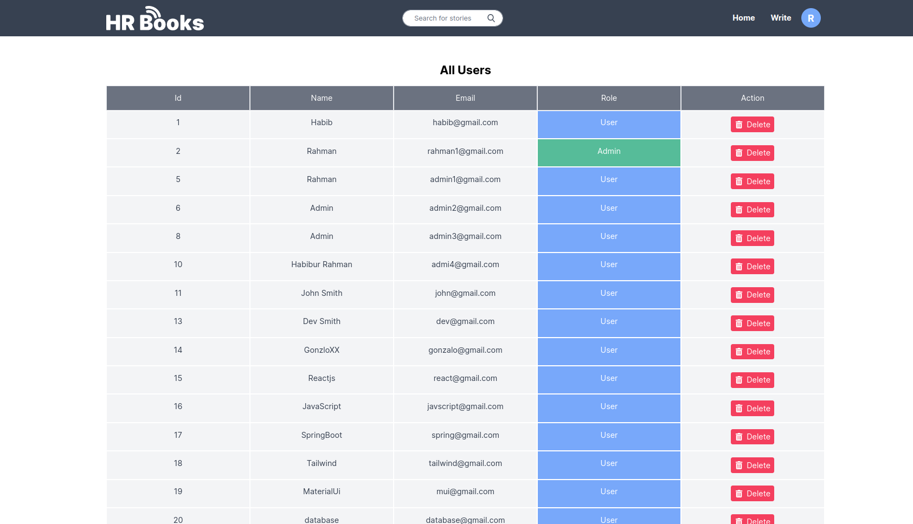
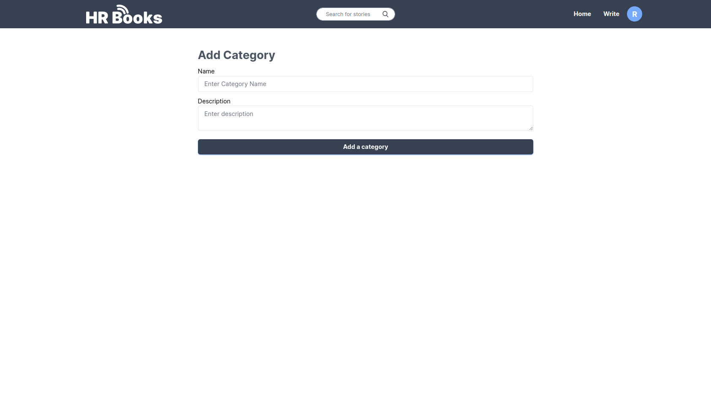

# HRBooks

With this application, users may publish their own posts and read those of others on a full-stack blog sharing platform. On a particular post, they are able to leave their own comments.

1. Registering and logging in
2. Read and write a blog 
3. Comment on a blog 
4. View a user's blog that includes previous blogs
5. Modify and remove the current blog
6. The administrative dashboard
7. The administrator can add new categories and remove people

## Technologies Used

1.  Java
2.  Spring Boot
3.  Maven
4.  Typescript
5.  JavaScript
6.  React.js
7.  Tailwind CSS
8.  PostgreSQL

## Demo

### User Authentication

### Trending Blogs and Latest Blogs

### Post your own blog

### Searching and filtering

### Read blog with relevant blog

### Comment on any blog and suggestions

## User profile, update and delete your blog

## Admin Dashboard

## User List

## User List

## Post new category

